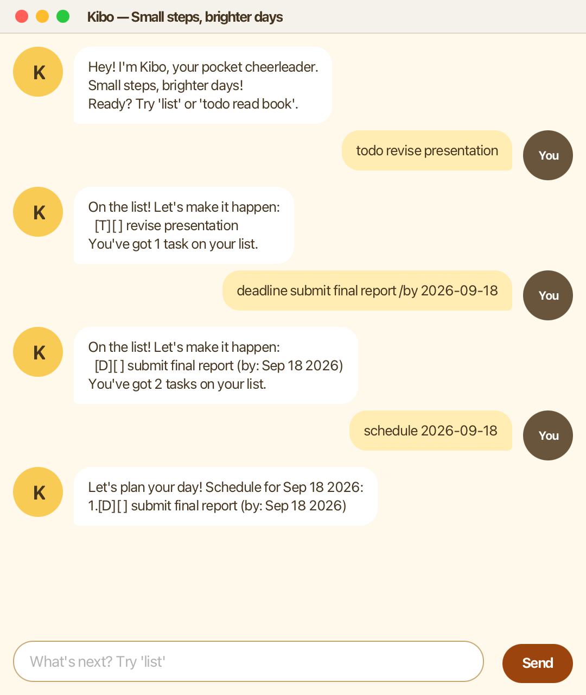

# Kibo User Guide

Kibo is a cheerful pocket cheerleader for organising everyday tasks. It helps you
record what needs doing, keep track of deadlines, and take one small step at a time.



## Quick start

1. Ensure Java 25 is installed on your computer.
2. Download the latest `kibo.jar` from the project's GitHub release.
3. Open a terminal in the folder containing the JAR.
4. Start Kibo with:

   ```shell
   java -jar kibo.jar
   ```

5. Type a command in the text field and press <kbd>Enter</kbd> or select **Send**.

## Features

### Add a to-do: `todo`

Adds a task without a date or time.

**Format:** `todo DESCRIPTION`

Example: `todo revise presentation`

### Add a deadline: `deadline`

Adds a task that is due on a specific date.

**Format:** `deadline DESCRIPTION /by yyyy-MM-dd`

Example: `deadline submit final report /by 2026-09-18`

### Add an event: `event`

Adds a task with a start and end. The times can be written in a flexible form.

**Format:** `event DESCRIPTION /from START /to END`

Example: `event team meeting /from 2026-09-18 14:00 /to 15:00`

To include an event in a dated schedule, begin its start with a date in
`yyyy-MM-dd` format, as in the example above. Older free-form events such as
`/from Mon 2pm /to 4pm` are still displayed normally but cannot appear in a
specific day's schedule.

### View all tasks: `list`

Displays every task in its current order. `[X]` means completed and `[ ]` means
not completed.

**Format:** `list`

### Find tasks: `find`

Displays tasks whose descriptions contain the supplied keyword. Searching ignores
letter case.

**Format:** `find KEYWORD`

Example: `find report`

### View a schedule: `schedule`

Displays deadlines due on a date and events that start on that date.

**Format:** `schedule yyyy-MM-dd`

Example: `schedule 2026-09-18`

### Mark a task as done: `mark`

Marks the task at the given number as completed.

**Format:** `mark TASK_NUMBER`

Example: `mark 2`

### Mark a task as not done: `unmark`

Reverses a completed task's status.

**Format:** `unmark TASK_NUMBER`

Example: `unmark 2`

### Delete a task: `delete`

Removes the task at the given number from the list.

**Format:** `delete TASK_NUMBER`

Example: `delete 3`

### Exit Kibo: `bye`

Closes Kibo after its farewell message.

**Format:** `bye`

## Saving tasks

Kibo saves the task list automatically whenever it changes and loads it when it
starts. Its data is stored in `data/duke.txt`, relative to the folder from which
you run the application. Keep this file if you want Kibo to remember your tasks.

## Command summary

| Action | Command format |
| --- | --- |
| Add a to-do | `todo DESCRIPTION` |
| Add a deadline | `deadline DESCRIPTION /by yyyy-MM-dd` |
| Add an event | `event DESCRIPTION /from START /to END` |
| View all tasks | `list` |
| Find tasks | `find KEYWORD` |
| View a schedule | `schedule yyyy-MM-dd` |
| Mark a task done | `mark TASK_NUMBER` |
| Mark a task not done | `unmark TASK_NUMBER` |
| Delete a task | `delete TASK_NUMBER` |
| Exit Kibo | `bye` |
